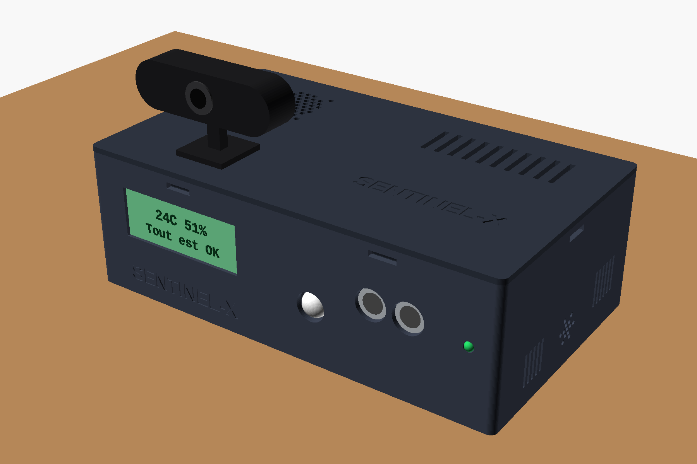
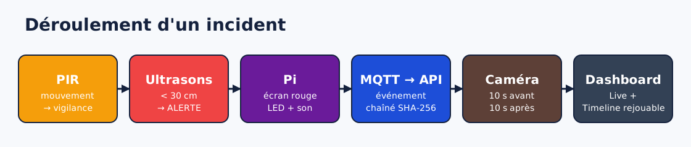
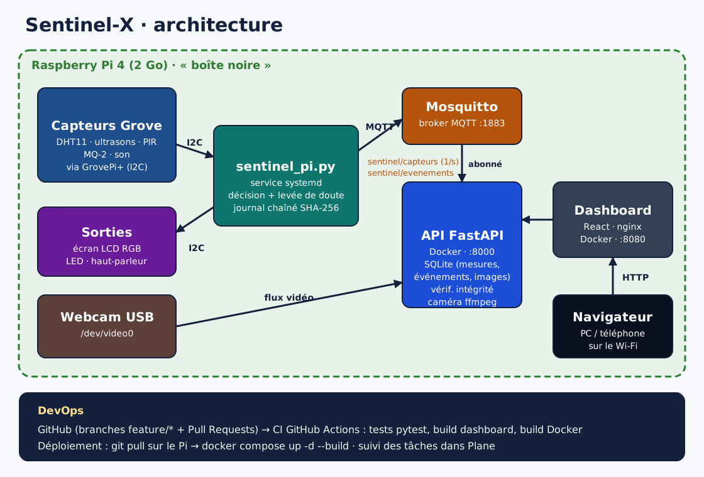
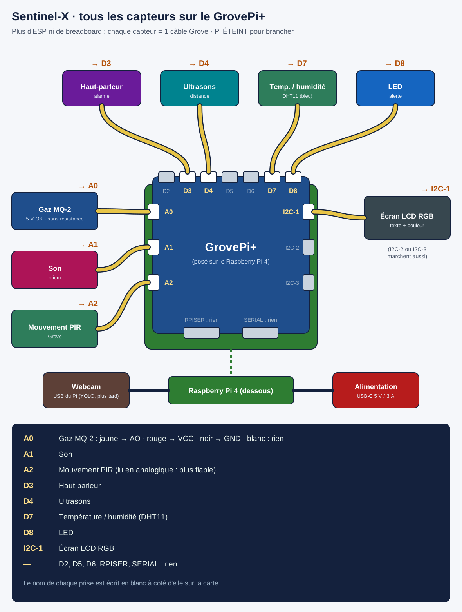
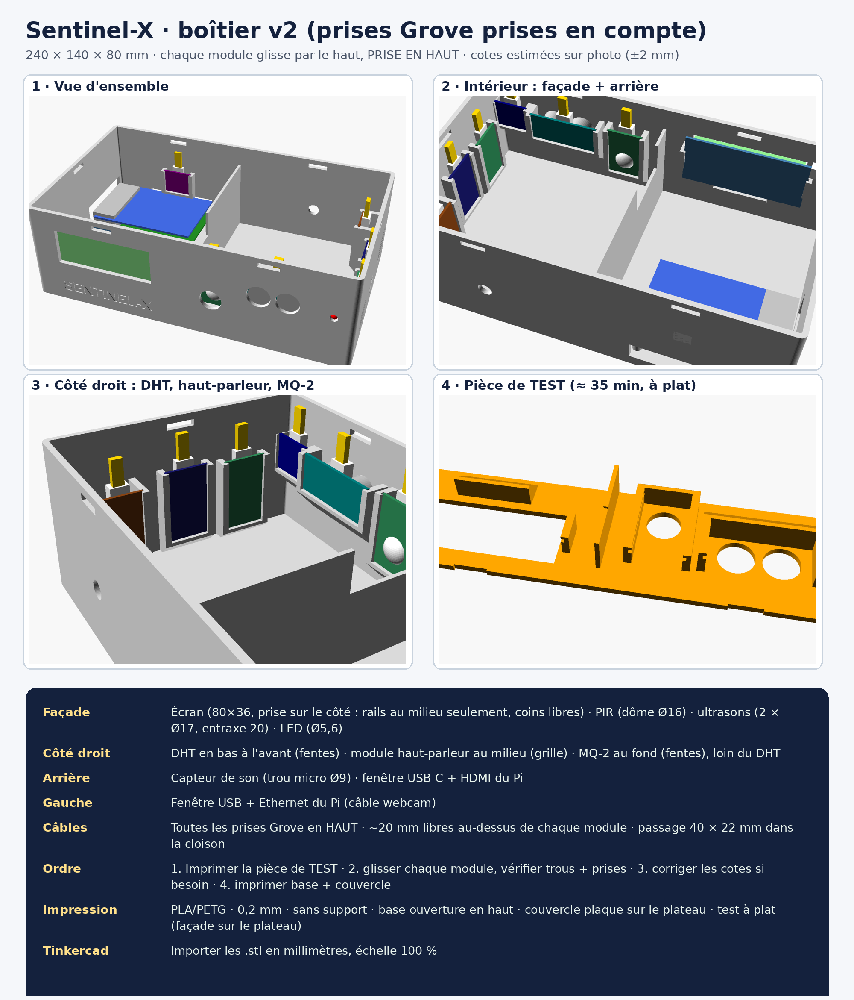
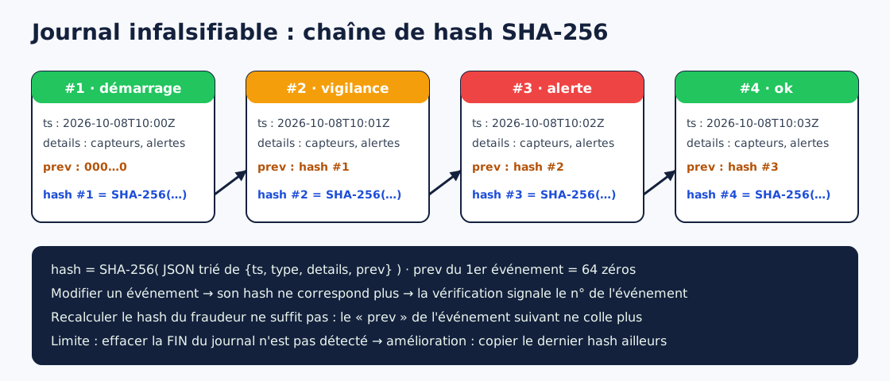
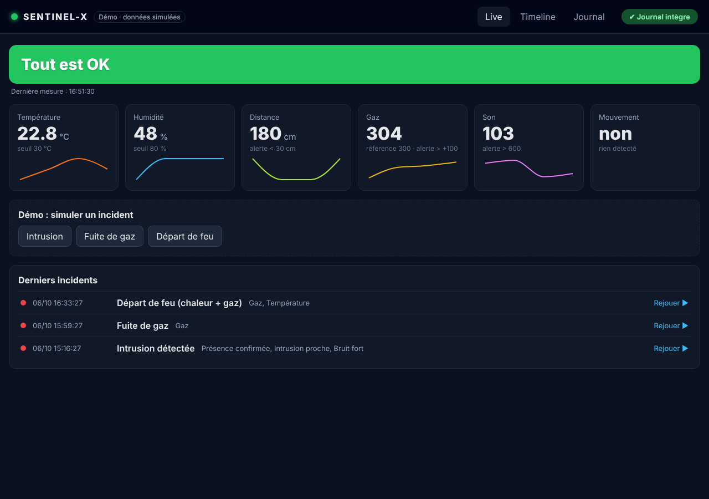
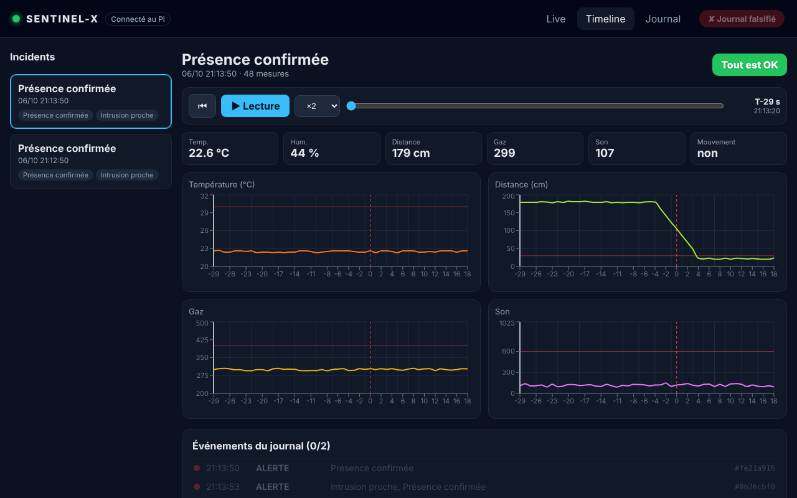
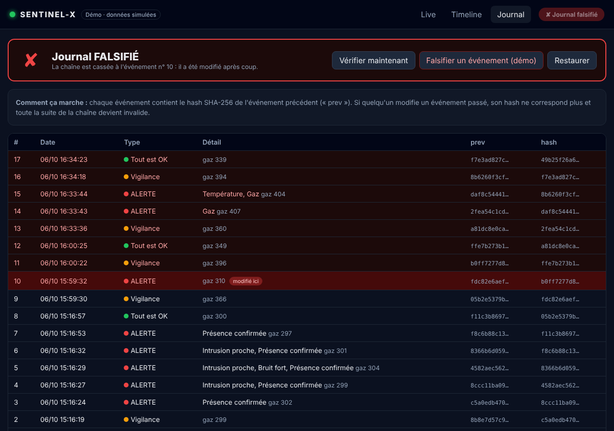

# Sentinel-X · Documentation technique

**Boîte noire de sécurité IoT : capteurs, journal infalsifiable et timeline d'incidents rejouable**

Workshop EPSI Mastère 1 · « Mission Sentinel-X » · octobre 2026  
Équipe : Baptiste Sandoz, Rémi Edmond, Jawad Assahnoun  
Dépôt : https://github.com/bsandoz79/Projet-Sentinel-X



---

## Sommaire

1. [Présentation du projet](#1-présentation-du-projet)
2. [Architecture](#2-architecture)
3. [Matériel et câblage](#3-matériel-et-câblage)
4. [Boîtier imprimé en 3D](#4-boîtier-imprimé-en-3d)
5. [Script capteurs (Raspberry Pi)](#5-script-capteurs-raspberry-pi)
6. [Messagerie MQTT](#6-messagerie-mqtt)
7. [API FastAPI](#7-api-fastapi)
8. [Journal infalsifiable](#8-journal-infalsifiable)
9. [Caméra](#9-caméra)
10. [Dashboard web](#10-dashboard-web)
11. [DevOps : Git, CI, Docker, Plane](#11-devops--git-ci-docker-plane)
12. [Installation et déploiement](#12-installation-et-déploiement)
13. [Tests et validation](#13-tests-et-validation)
14. [Sécurité](#14-sécurité)
15. [Difficultés rencontrées et solutions](#15-difficultés-rencontrées-et-solutions)
16. [Limites et améliorations](#16-limites-et-améliorations)
17. [Annexes](#17-annexes)
18. [Journal des modifications](#18-journal-des-modifications)

---

## 1. Présentation du projet

### Le besoin

Quand un incident se produit dans un local sensible (intrusion, fuite de gaz, départ de feu), il faut deux choses :

- **réagir tout de suite** : alerte visuelle et sonore, information en direct ;
- **comprendre après coup** ce qui s'est passé, avec des preuves fiables, qu'on ne puisse pas modifier.

### Notre réponse : une « boîte noire »

Sentinel-X fonctionne comme la boîte noire d'un avion :

| Fonction | Ce que fait Sentinel-X |
|---|---|
| **Détecter** | 5 capteurs : température/humidité, distance, mouvement, gaz, son |
| **Confirmer** | Levée de doute : un mouvement seul donne une *vigilance*, un mouvement avec une approche donne une *alerte* |
| **Alerter** | Écran couleur, LED, haut-parleur, dashboard en direct |
| **Enregistrer** | Chaque changement d'état est écrit dans un **journal chaîné par hash SHA-256** |
| **Prouver** | Une séquence caméra (10 s avant / 10 s après chaque alerte) avec l'empreinte de chaque image |
| **Rejouer** | Une **timeline** rejoue l'incident seconde par seconde : courbes, état et images synchronisés |



---

## 2. Architecture



| Composant | Technologie | Rôle |
|---|---|---|
| Raspberry Pi 4 (2 Go) | Raspberry Pi OS 64 bits | Serveur embarqué, tout tourne en local |
| GrovePi+ | Shield I2C (microcontrôleur ATmega) | Lit les capteurs Grove (analogique et numérique) |
| `sentinel_pi.py` | Python 3, service systemd | Lit les capteurs, décide de l'état, pilote écran/LED/son, signe le journal, publie en MQTT |
| Mosquitto | Conteneur Docker `eclipse-mosquitto:2` | Broker MQTT (port 1883) |
| API | FastAPI + SQLite + ffmpeg, Docker | Stocke mesures, événements et images ; calcule les incidents ; vérifie l'intégrité ; sert la caméra |
| Dashboard | React (Vite) + Recharts, servi par nginx | Live, Timeline rejouable, Journal |
| Webcam | USB (Logitech), `/dev/video0` | Flux vidéo + séquences d'incident |

**Choix d'architecture :**

- **Tout en local sur le Pi.** Le système continue de fonctionner sans Internet, ce qui est indispensable pour un équipement de sécurité.
- **MQTT entre les capteurs et le serveur.** Les deux parties sont découplées : on peut ajouter d'autres boîtiers ou remplacer le script sans toucher à l'API.
- **Docker** pour l'API et le dashboard : déploiement reproductible en une commande.
- **Double journal** : un fichier local sur le Pi (`journal_sentinel.jsonl`) et une copie en base. Si le réseau coupe, rien n'est perdu ; le script renvoie tout le journal au démarrage.

---

## 3. Matériel et câblage

### Liste du matériel

| Élément | Référence | Branchement |
|---|---|---|
| Raspberry Pi 4 Model B 2 Go | + alimentation USB-C 5 V / 3 A | — |
| GrovePi+ | Dexter Industries | Sur le connecteur 40 broches du Pi |
| Capteur de gaz | MQ-2 (module « Flying-Fish ») | **A0** (fils Dupont : jaune → AO, rouge → VCC, noir → GND) |
| Capteur de son | Grove Sound Sensor | **A1** |
| Détecteur de mouvement | Grove PIR Motion Sensor | **A2** (lu en analogique, plus fiable) |
| Haut-parleur | Grove Speaker | **D3** (PWM) |
| Distance | Grove Ultrasonic Ranger | **D4** |
| Température / humidité | Grove DHT11 (bleu) | **D7** |
| LED | Grove LED (RGB) | **D8** |
| Écran | Grove LCD RGB Backlight v4.0 | **I2C** (adresses 0x3E texte, 0x62 couleur) |
| Webcam | USB | Port USB du Pi |



### Historique du choix matériel

Le premier prototype utilisait un **ESP8266** (NodeMCU) sur breadboard. Tous les capteurs y ont été validés un par un. Nous sommes ensuite passés au **GrovePi+ directement sur le Pi**, pour trois raisons :

- moins de câblage : chaque capteur se branche avec un seul câble Grove, sans breadboard ;
- 3 entrées analogiques, contre une seule sur l'ESP8266 : le gaz et le son peuvent fonctionner en même temps ;
- les prises Grove sont en 5 V, ce qui permet d'afficher le texte sur l'écran LCD (impossible en 3,3 V sur l'ESP).

---

## 4. Boîtier imprimé en 3D



| Caractéristique | Valeur |
|---|---|
| Dimensions | 240 × 140 × 80 mm, parois de 3 mm |
| Pièces | Base + couvercle clipsé (6 crochets à fenêtre) |
| Fixation des modules | Chaque module glisse **par le haut** dans un rail (2 rainures + butée en bas), **prise Grove vers le haut** |
| Façade | Écran (fenêtre 74 × 28), PIR (Ø16), ultrasons (2 × Ø17, entraxe 20), LED (Ø5,6), « SENTINEL-X » gravé |
| Côté droit | DHT (fentes, en bas), haut-parleur (grille), MQ-2 (fentes, en haut, **éloigné du DHT** car il chauffe) |
| Arrière | Micro du capteur de son (Ø9), USB-C + micro-HDMI du Pi |
| Côté gauche | USB + Ethernet du Pi (passage du câble webcam) |
| Intérieur | Cloison qui sépare le Pi (chaud) des capteurs, avec un passage de câbles de 40 × 22 mm ; 4 plots M2,5 pour le Pi ; aération sous le Pi |
| Couvercle | Grille pour un ventilateur de 40 mm au-dessus du Pi, fentes d'aération, nom gravé |

**Fichiers** (dossier `boitier/`) :

- `sentinel_v2_base.stl` et `sentinel_v2_couvercle.stl` : prêts à imprimer, compatibles Tinkercad (import en mm, échelle 100 %) ;
- `sentinel_v2_TEST_facade.stl` : bande de façade à imprimer en 35 min **avant** la grande impression, pour vérifier les rails ;
- `sentinel_boitier_v2.scad` : source **paramétrique** OpenSCAD. Toutes les cotes sont en haut du fichier ; on modifie un nombre et on réexporte.

**Impression** : PLA ou PETG, couches de 0,2 mm, 3 périmètres, remplissage 15-20 %, **sans support**. La base s'imprime ouverture vers le haut, le couvercle plaque sur le plateau.

---

## 5. Script capteurs (Raspberry Pi)

Fichier : `capteurs/sentinel_pi.py`. Il est lancé au démarrage par le service systemd `sentinel.service`. **On ne le lance jamais à la main en plus du service** : un verrou l'en empêche (voir « Robustesse » plus bas).

### Boucle principale (1 fois par seconde)

1. **Lecture** de tous les capteurs via le GrovePi+. Le GrovePi+ est piloté directement en I2C (adresse 0x04) par un mini-pilote intégré au script, sans bibliothèque externe.
2. **Décision** de l'état :

| Condition | Résultat |
|---|---|
| Température > 30 °C | alerte `temperature` |
| Humidité > 80 % | alerte `humidite` |
| Distance < 30 cm | alerte `intrusion` |
| Gaz > référence + 100 | alerte `gaz` |
| Son > 600 | alerte `bruit` |
| **PIR + distance < 100 cm** | alerte `presence` (**levée de doute**) |
| PIR seul, distance < 100 cm, valeurs proches des seuils | **vigilance** |
| Aucune lecture DHT valide depuis 30 s | état `dht` (capteur en erreur) |

Une **alerte passe toujours avant** une panne du DHT : même si le DHT est en erreur, une intrusion déclenche bien l'alarme, la caméra et le journal.

3. **Sorties locales** :

| État | Écran | LED / haut-parleur |
|---|---|---|
| OK | vert, « 24C 51% / Tout est OK » | éteints |
| Vigilance | orange | éteints |
| Alerte | rouge, « ALERTE intrusion » | **sirène** : bip-bip rapide (0,25 s) + LED |
| Fin d'alerte (5 s) | rouge, « Fin d'alarme... » | la sirène finit ses 5 s puis s'arrête |
| DHT en erreur | violet, « Verifier DHT » | — |

4. **Publication MQTT** de la mesure (1 par seconde).
5. **Journal** : à chaque **changement d'état**, un événement chaîné est ajouté au fichier local puis publié.

### Alarme continue

La sirène tourne dans un **thread** séparé, pour ne pas bloquer la lecture des capteurs. Chaque seconde où une alerte est détectée, elle est relancée pour `DUREE_ALARME` = 5 s. Résultat : elle sonne **au moins 5 s**, **tant que l'incident dure**, puis s'arrête 5 s après la dernière alerte. Un verrou I2C empêche la sirène et les capteurs de parler au GrovePi+ en même temps.

### Robustesse

| Problème possible | Protection |
|---|---|
| Deux copies du script (service + lancement manuel) qui se battent pour le GrovePi+ | **verrou** `fcntl` sur `capteurs/.sentinel.lock` : la 2e copie s'arrête avec « Sentinel-X tourne déjà » |
| Coupure de courant pendant l'écriture du journal | chaque événement est écrit avec `fsync` ; au redémarrage, une ligne abîmée est **ignorée** au lieu de faire planter le script |
| Lecture ratée du GrovePi+ (valeur 65535) | lecture refaite jusqu'à 3 fois, puis valeur marquée invalide (-1) : **pas de fausse alerte** |
| Le DHT11 rate environ une lecture sur deux | la dernière bonne valeur est gardée `DHT_TOLERANCE` = 30 s avant de signaler une erreur |
| Référence gaz pas encore valide (MQ-2 froid) | pas d'alerte gaz tant que la référence vaut 0 |

### Référence gaz adaptative

Le MQ-2 dérive avec sa température. La référence est mesurée au démarrage, après 10 s de stabilisation, puis elle suit lentement l'air ambiant (moyenne glissante). Elle ne bouge pas pendant une alerte gaz, pour qu'une vraie fuite ne soit pas « absorbée ».

### Configuration

Tout se règle en haut du fichier : `AVEC_xxx = True/False` pour activer chaque capteur, `PORT_xxx` pour les ports, `SEUIL_xxx` pour les seuils, `DUREE_ALARME` et `DHT_TOLERANCE`. Les identifiants MQTT (`MQTT_CAPTEURS_USER` / `MQTT_CAPTEURS_PASS`) sont lus dans le fichier `.env` à la racine du projet (voir section 14).

### Simulateur

`capteurs/simulateur.py` publie de fausses mesures, avec une intrusion toutes les 2 minutes, **au même format**. Il permet de tester l'API et le dashboard sans le matériel, et sert de **plan B** pour la démo.

---

## 6. Messagerie MQTT

| Topic | QoS | Fréquence | Contenu |
|---|---|---|---|
| `sentinel/capteurs` | 0 | 1 / s | `{ts, temp, hum, dist, gaz, ref_gaz, son, pir, etat, alertes}` |
| `sentinel/evenements` | 1 | à chaque changement d'état | `{ts, type, details, prev, hash}` |

Exemple de mesure :
```json
{"ts": 1791363557732, "temp": 22.4, "hum": 46, "dist": 181, "gaz": 303, "ref_gaz": 300,
 "son": 122, "pir": false, "alertes": [], "etat": "ok"}
```

**Comptes et droits** (fichier `mosquitto/acl`, connexion anonyme interdite) :

| Compte | Utilisé par | Droits |
|---|---|---|
| `capteurs` | `sentinel_pi.py` | **écriture seule** sur `sentinel/capteurs` et `sentinel/evenements` |
| `api` | API FastAPI | **lecture seule** sur `sentinel/#` |

---

## 7. API FastAPI

Fichiers : `api/main.py`, `api/chaine.py`, `api/camera.py`. Elle tourne dans Docker (`network_mode: host`, port 8000). La documentation interactive Swagger est disponible sur `http://IP-du-Pi:8000/docs`.

### Base SQLite (`/data/sentinel.db`, volume Docker)

| Table | Contenu |
|---|---|
| `mesures` | 1 ligne par seconde (conservées 7 jours) |
| `evenements` | journal chaîné : `id, ts, type, details, prev, hash` (hash unique : pas de doublon) |
| `photos` | photo prise à chaque alerte : `evt_hash, fichier, sha256` |
| `images` | séquences d'incident (1 image / s) : `ts, fichier, sha256` |

### Routes

| Route | Rôle |
|---|---|
| `GET /api/live` | dernière mesure |
| `GET /api/incidents` | liste des incidents. Un incident va de la 1re alerte jusqu'au retour à un état sans alerte. |
| `GET /api/incidents/{id}/replay` | tout pour rejouer : mesures de 30 s avant à 30 s après (incident de 30 min max), événements, images |
| `GET /api/evenements` | journal complet |
| `GET /api/integrite` | recalcule toute la chaîne : `{ok, total, premier_invalide}` |
| `GET /api/camera` | image actuelle de la webcam |
| `GET /api/camera/stream` | flux vidéo MJPEG en direct |
| `GET /api/photos/{hash}` | photo d'un événement d'alerte |
| `GET /api/images/{ts}` | image d'une séquence d'incident |
| `GET /api/sante` | état du service et de la caméra |

---

## 8. Journal infalsifiable



**Principe** : chaque événement contient le hash SHA-256 de l'événement précédent (`prev`). Son propre hash est calculé sur le JSON trié de `{ts, type, details, prev}`. Le premier événement pointe vers 64 zéros.

**Vérification** (`GET /api/integrite`, et le badge en haut du dashboard) : l'API recalcule chaque hash et vérifie chaque lien `prev`. Elle renvoie le numéro du **premier événement modifié**.

| Attaque | Détectée ? |
|---|---|
| Modifier un événement passé | ✅ son hash ne correspond plus |
| Modifier **et** recalculer son hash | ✅ le `prev` de l'événement suivant ne correspond plus |
| Supprimer un événement au milieu | ✅ le chaînage est cassé |
| Supprimer les **derniers** événements | ❌ limite connue (voir section 16) |

Les **photos et images** ne sont pas dans le hash de l'événement (elles arrivent après), mais chacune a sa propre **empreinte SHA-256**, affichée dans le dashboard.

Démo : en mode démo, le bouton « Falsifier un événement » du dashboard montre la détection en direct. Sur l'API réelle, on peut le montrer en modifiant une ligne de la base SQLite.

---

## 9. Caméra

Fichier : `api/camera.py` (ffmpeg dans le conteneur API, webcam passée avec `devices: /dev/video0`).

- **Capture continue** : ffmpeg garde la webcam ouverte (MJPEG 1280×720, 10 images/s, sans ré-encodage) et réécrit la dernière image en continu. Si ffmpeg s'arrête, il est relancé automatiquement, avec un mode de secours en 640×480.
- **Flux en direct** : `/api/camera/stream` envoie un flux MJPEG que le navigateur affiche comme une vidéo.
- **Séquence d'incident** : les 10 dernières secondes sont gardées en mémoire, à 1 image/s. À la première alerte, ces **10 s « avant »** sont enregistrées ; ensuite l'API relance l'enregistrement à **chaque mesure qui contient une alerte**. On obtient donc **1 image/s pendant tout l'incident**, même long, puis **10 s « après »** la dernière seconde d'alerte. Chaque image a son empreinte SHA-256. Environ 150 Ko par image, supprimées au bout de 7 jours.
- **Photo d'alerte** : une copie instantanée de l'image du moment, liée à l'événement.

---

## 10. Dashboard web

Dossier `dashboard/` (React + Vite + Recharts). Il est servi par nginx sur le Pi (port 8080).

| Page | Contenu |
|---|---|
| **Live** | bandeau d'état coloré, 6 cartes capteurs avec mini-courbes, webcam en direct, derniers incidents |
| **Timeline** | liste des incidents, lecteur (lecture/pause, vitesse ×1 à ×10, curseur), 4 courbes synchronisées, **caméra de l'incident image par image** (rangée de vignettes qui défile, la page garde sa largeur même pour un long incident), événements du journal qui s'allument au fil de la lecture |
| **Journal** | tous les événements avec `prev` / `hash`, vérification d'intégrité, ligne cassée surlignée en rouge |

Un badge « Journal intègre ✔ / falsifié ✘ » est vérifié toutes les 5 s sur toutes les pages.







**Deux modes :**

- **Démo** (`VITE_API_URL` vide) : données simulées dans le navigateur, avec des boutons pour simuler des incidents et falsifier le journal ;
- **Connecté au Pi** (`VITE_API_URL=http://IP-du-Pi:8000`) : données réelles.

Le dashboard est responsive : il est utilisable sur téléphone.

---

## 11. DevOps : Git, CI, Docker, Plane

### Git et GitHub

- Dépôt : `bsandoz79/Projet-Sentinel-X`.
- **Une branche par fonctionnalité** (`feature/webcam`, `fix/webcam-fluide`, `feature/sequence-incident`, `feature/alarme-continue`, `fix/capteurs-robustes`, `feature/mqtt-securise`…), puis une **Pull Request** vers `main` et un merge seulement quand la CI est verte.
- **Chaque `feat` ou `fix` met aussi à jour cette documentation** (section 18).
- Messages de commit au format *conventional commits* (`feat(camera): …`, `fix(webcam): …`).
- Le Pi ne fait que des `git pull` : il ne commite jamais.

### Intégration continue (`.github/workflows/ci.yml`)

À chaque push et à chaque Pull Request :

1. **api** : installation des dépendances, puis `pytest` (5 tests sur la chaîne de hash : intacte, modification, suppression, recalcul frauduleux, compatibilité avec le script du Pi) ;
2. **dashboard** : `npm install`, puis `npm run build` ;
3. **docker** : `docker compose build`.

### Conteneurs (`docker-compose.yml`)

| Service | Image | Port |
|---|---|---|
| `mosquitto` | `eclipse-mosquitto:2`, conteneur `mosquitto`, authentification + ACL (`mosquitto/secrets`, généré par `securiser_mqtt.sh`) | 1883 |
| `api` | build `./api` (Python 3.12 + ffmpeg) | 8000 (réseau hôte) |
| `dashboard` | build `./dashboard` (Node → nginx), ou nginx + fichiers déjà construits | 8080 |

Tous les services ont `restart: unless-stopped` : ils redémarrent automatiquement avec le Pi.

### Organisation : Plane

Les tâches sont gérées dans Plane, en **6 modules** (Matériel, Code capteurs, Infrastructure, Journal + timeline, Vision, Sécurité + soutenance) et **3 cycles** (matériel qui fonctionne → données et timeline → bonus et soutenance). Chaque carte suit le cycle À faire → En cours → En revue (PR ouverte) → Fait (mergé et testé), avec le lien de la PR.

---

## 12. Installation et déploiement

### Sur le Pi (première installation)

```bash
# Système
sudo raspi-config nonint do_i2c 0 && sudo reboot
sudo apt install -y i2c-tools python3-smbus2 python3-paho-mqtt
curl -fsSL https://get.docker.com | sudo sh && sudo usermod -aG docker $USER

# Projet
git clone https://github.com/bsandoz79/Projet-Sentinel-X.git
cd Projet-Sentinel-X

# Serveur : MQTT sécurisé (crée .env + mots de passe), puis l'API
bash securiser_mqtt.sh
nohup docker compose up -d --build api > build.log 2>&1 &

# Script capteurs en service
sudo cp capteurs/sentinel.service /etc/systemd/system/
sudo sed -i 's/User=admin/User=jawad/; s#/home/admin/sentinel-x#/home/jawad/Projet-Sentinel-X#g' /etc/systemd/system/sentinel.service
sudo systemctl daemon-reload && sudo systemctl enable --now sentinel
```

### Dashboard (construit sur un PC, servi par le Pi)

```powershell
cd dashboard
echo VITE_API_URL=http://IP-du-Pi:8000 > .env
npm install
npm run build
scp -r dist/* jawad@IP-du-Pi:~/dashboard-dist/
```
```bash
# sur le Pi, une seule fois
chmod -R a+rX ~/dashboard-dist
docker run -d --name dashboard --restart unless-stopped -p 8080:80 \
  -v ~/dashboard-dist:/usr/share/nginx/html:ro nginx:alpine
```

### Mise à jour

```bash
cd ~/Projet-Sentinel-X
sudo systemctl stop sentinel
git checkout . && git pull            # efface les essais faits à la main sur le Pi
nohup docker compose up -d --build api > build.log 2>&1 &
sudo systemctl start sentinel
journalctl -u sentinel -f             # « MQTT : connecté en tant que capteurs »
```

> ⚠️ Ne pas lancer `python3 sentinel_pi.py` à la main pendant que le service tourne : le verrou refusera, et c'est voulu. Pour relancer : `sudo systemctl restart sentinel`. Pour couper l'alarme : `sudo systemctl stop sentinel`.

### Adresses utiles

| Service | Adresse |
|---|---|
| Dashboard | `http://IP-du-Pi:8080` |
| API + Swagger | `http://IP-du-Pi:8000/docs` |
| Santé | `http://IP-du-Pi:8000/api/sante` |
| Logs du script | `journalctl -u sentinel -f` |
| Logs de l'API | `docker logs projet-sentinel-x-api-1 --tail 50` |
| Connexions MQTT refusées | `docker logs mosquitto \| grep "not authorised"` |

---

## 13. Tests et validation

### Tests matériels (réalisés)

| Capteur / sortie | Test | Résultat |
|---|---|---|
| DHT11 | souffle sur le capteur | 51 % → 95 %, 24 → 27 °C, **alerte humidité** ✅ |
| Ultrasons | main à 16 cm | **alerte intrusion** ✅ |
| PIR | mouvement devant | **vigilance** ✅ |
| PIR + ultrasons | approche | **alerte présence** (levée de doute) ✅ |
| MQ-2 | après chauffe | référence ≈ 360, stable ✅ |
| Son | bruit / silence | 0 → 240 ✅ |
| Écran, LED, haut-parleur | pendant une alerte | rouge, clignote, bipe ✅ |
| Alarme continue | main devant l'ultrason ~15 s | sonne tout du long, puis 5 s « Fin d'alarme » ✅ |
| Alerte malgré DHT en panne | DHT en erreur + main à 1 cm | alerte intrusion journalisée ✅ |
| Tolérance DHT | DHT qui rate 1 lecture / 2 | température affichée en continu ✅ |
| Webcam | flux + séquence d'incident | vidéo fluide, ~20 images par incident ✅ |
| Chaîne complète | capteurs → MQTT → API → dashboard | incident visible et rejouable ✅ |

### Tests automatiques

- `api/test_chaine.py` (pytest, lancés par la CI) : intégrité, modification, suppression, recalcul frauduleux, compatibilité du calcul avec le script du Pi.
- Tests de bout en bout réalisés pendant le développement : simulateur → Mosquitto → API → dashboard, falsification en base détectée, séquence caméra avec une fausse webcam.
- Test du verrou : une 2e copie du script est refusée, une nouvelle copie repart après l'arrêt de la 1re.
- Test de la sécurité MQTT (Mosquitto 2 avec la configuration du projet) :

| Essai | Résultat attendu | Obtenu |
|---|---|---|
| Connexion anonyme | refusée | « Not authorized » ✅ |
| `capteurs` avec un mauvais mot de passe | refusée | « Not authorized » ✅ |
| `capteurs` publie une mesure | reçue par l'API | ✅ |
| `api` publie un faux événement | bloqué par l'ACL | non reçu ✅ |
| `capteurs` publie hors de `sentinel/` | bloqué par l'ACL | non reçu ✅ |

### Scénario de démo (3 minutes)

1. Le boîtier est au vert : le dashboard Live est projeté.
2. Quelqu'un s'approche : orange, puis **rouge** avec l'alarme qui sonne tant qu'il reste ; l'incident apparaît.
3. **Timeline** : on rejoue l'incident, les courbes et les images de la caméra défilent ensemble.
4. **Journal** : on montre « Journal intègre », puis une falsification détectée.
5. Conclusion : limites et suite du projet.

Plan B : une vidéo de la démo est enregistrée à l'avance, et le simulateur peut remplacer les capteurs.

---

## 14. Sécurité

**En place :**

- traitement **100 % local**, aucune donnée envoyée à l'extérieur ;
- journal chaîné SHA-256, avec vérification automatique et visible ;
- empreinte SHA-256 de chaque image ;
- conteneurs isolés, redémarrage automatique, données dans des volumes Docker ;
- **MQTT authentifié** : `allow_anonymous false`, un compte par programme, mots de passe aléatoires stockés **hachés** par Mosquitto ;
- **moindre privilège (ACL)** : `capteurs` ne peut qu'écrire, `api` ne peut que lire ; un compte volé ne permet pas d'injecter de faux événements depuis l'API ;
- secrets dans `.env` (droits 600), **jamais versionné** (`.gitignore`) ; modèle sans secret : `.env.example` ;
- une seule commande pour tout mettre en place : `bash securiser_mqtt.sh` ;
- connexions refusées tracées dans les logs de Mosquitto.

**À activer ou à améliorer :**

| Risque | Mesure |
|---|---|
| Mots de passe MQTT lisibles sur le réseau (pas de chiffrement) | TLS sur MQTT (port 8883) avec certificat |
| Dashboard et API sans authentification | page de connexion + jeton (JWT) sur l'API, HTTPS via un reverse proxy |
| Suppression de la fin du journal | copier régulièrement le dernier hash vers une autre machine, ou le signer avec horodatage |
| Accès physique au Pi | boîtier fermé, carte SD chiffrée, sauvegardes |

---

## 15. Difficultés rencontrées et solutions

| Problème | Cause | Solution |
|---|---|---|
| PIR toujours en « mouvement » (ESP8266) | broche en l'air + interférences Wi-Fi | résistance de tirage 10 kΩ, Wi-Fi coupé, puis passage au GrovePi+ (lecture analogique) |
| Odeur de brûlé, ESP abîmé | mauvais câblage du MQ-2 (5 V sur A0, broches voisines) | pont diviseur, puis version 3,3 V ; MQ-2 finalement branché sur le GrovePi+ (5 V autorisé) |
| DHT toujours en erreur | capteur défectueux | remplacement du capteur |
| Écran : couleur seulement, pas de texte | le texte a besoin de 5 V, l'ESP donnait 3,3 V | écran branché sur l'I2C du GrovePi+ (5 V) |
| GrovePi+ absent de `i2cdetect` | particularité du firmware (n'apparaît pas au scan) | test direct par le script : la lecture DHT a prouvé qu'il répond |
| Gaz toujours à 0 | mauvais contact des fils Dupont dans la prise Grove | fils renfoncés ; référence remesurée au démarrage |
| Webcam saccadée | ouverture/fermeture de la webcam à chaque image | capture continue ffmpeg + flux MJPEG |
| Pi qui ne répond plus pendant le build | `npm install` trop lourd pour 2 Go de RAM | dashboard construit sur le PC, le Pi ne sert que les fichiers |
| Build interrompu à la coupure SSH | processus lié au terminal | `nohup … &` |
| Erreur 403 sur le dashboard | permissions des fichiers copiés depuis Windows | `chmod -R a+rX` |
| Capteurs à 65535 / -1, « DHT erreur », SSH qui coupe, compte à rebours de l'écran décalé | **le script tournait deux fois** : le service systemd + une copie lancée à la main, qui interrogeaient le GrovePi+ en même temps | une seule copie (le service) + **verrou** dans le script |
| Script qui plante au démarrage (`UnicodeDecodeError`) | journal abîmé (octets nuls) après une coupure de courant | lignes abîmées ignorées + écriture avec `fsync` |
| Alarme muette pendant une intrusion | l'état « DHT en erreur » passait avant l'alerte | priorité donnée aux alertes |
| Alarme trop courte (3 bips) qui bloquait les mesures | bips joués dans la boucle principale | sirène dans un thread, relancée tant que l'alerte dure |
| Images de l'incident arrêtées au bout de 10 s | enregistrement déclenché seulement par un changement d'état | relance à chaque mesure en alerte |
| Timeline qui sortait de l'écran | rangée de vignettes trop large dans une grille CSS | colonnes en `minmax(0, 1fr)` + défilement des vignettes |

---

## 16. Limites et améliorations

**Limites actuelles :**

- un seul boîtier, sans redondance : si le Pi tombe, la surveillance s'arrête ;
- la suppression de la **fin** du journal n'est pas détectable sans copie externe ;
- le DHT11 est peu précis (±2 °C, ±5 %) ;
- le MQ-2 n'est pas étalonné en ppm : il détecte une variation, pas une concentration ;
- pas d'authentification sur le dashboard et l'API pour l'instant ;
- MQTT authentifié mais pas encore chiffré (TLS).

**Améliorations prévues :**

1. Sécurité : TLS sur MQTT, connexion sur le dashboard, HTTPS, journal signé (HMAC) pour qu'il soit impossible de recalculer la chaîne sans la clé.
2. Ancrage du journal : envoi périodique du dernier hash vers un serveur distant, ou signature horodatée (RFC 3161).
3. Détection de personnes par IA (YOLO) sur les images de la caméra, comme 3e niveau de levée de doute.
4. Notifications : e-mail ou SMS à chaque alerte.
5. Export d'un incident en rapport PDF signé (preuve pour une assurance ou un dépôt de plainte).
6. Plusieurs boîtiers qui remontent à un serveur central (MQTT le permet déjà).
7. Tourelle motorisée (servo + ultrasons) pour un balayage « radar ».

---

## 17. Annexes

### Arborescence du dépôt

```
Projet-Sentinel-X/
├── capteurs/
│   ├── sentinel_pi.py        # script principal (Pi + GrovePi+)
│   ├── simulateur.py         # fausses données (tests, plan B)
│   └── sentinel.service      # service systemd
├── api/
│   ├── main.py               # API FastAPI (MQTT, SQLite, routes)
│   ├── chaine.py             # calcul + vérification de la chaîne de hash
│   ├── camera.py             # webcam : flux continu, séquences d'incident
│   ├── test_chaine.py        # tests pytest
│   ├── requirements.txt
│   └── Dockerfile
├── dashboard/                # React (Vite) : Live, Timeline, Journal
├── mosquitto/
│   ├── mosquitto.conf        # broker : anonyme interdit, logs
│   └── acl                   # droits par compte
├── securiser_mqtt.sh         # crée .env + mots de passe MQTT, redémarre les services
├── .env.example              # modèle (le vrai .env n'est jamais versionné)
├── docker-compose.yml
├── .github/workflows/ci.yml  # CI GitHub Actions
└── docs/                     # cette documentation + schémas + boîtier
```

### Commandes utiles

| Besoin | Commande |
|---|---|
| Voir les messages MQTT | `set -a; . ./.env; set +a` puis `mosquitto_sub -h localhost -u api -P "$MQTT_API_PASS" -t 'sentinel/#' -v` |
| État des conteneurs | `docker ps` |
| Relancer l'API | `docker restart projet-sentinel-x-api-1` |
| État du script capteurs | `systemctl status sentinel` |
| Relancer / arrêter le script | `sudo systemctl restart sentinel` / `sudo systemctl stop sentinel` |
| Bus I2C | `i2cdetect -y 1` (écran : 3e et 62) |
| Webcam détectée | `ls /dev/video*` |
| Adresse IP du Pi | `hostname -I` |
| Lancer le simulateur | `nohup python3 capteurs/simulateur.py --user capteurs --password <MQTT_CAPTEURS_PASS> > simu.log 2>&1 &` |
| Arrêter le simulateur | `pkill -f simulateur.py` |

---

## 18. Journal des modifications

Chaque `feat` ou `fix` mergé dans `main` est ajouté ici.

| Date | Type | Branche / PR | Changement |
|---|---|---|---|
| 06/10 | feat | `main` | capteurs sur GrovePi+, MQTT, API FastAPI + SQLite, dashboard React, journal chaîné SHA-256 |
| 07/10 | feat | `feature/webcam` | photo à chaque alerte, webcam en direct sur le dashboard |
| 07/10 | fix | `fix/webcam-fluide` | capture continue ffmpeg + flux MJPEG (webcam fluide) |
| 07/10 | feat | `feature/sequence-incident` (PR #3) | séquence caméra 10 s avant / 10 s après, synchronisée dans la Timeline |
| 07/10 | docs | `docs/documentation` (PR #4) | documentation complète, schémas, boîtier |
| 07/10 | feat | `feature/alarme-continue` (PR #5) | alarme continue (5 s, relancée tant que l'alerte dure) + 1 image/s sur tout l'incident |
| 07/10 | fix | `feature/alarme-continue` (PR #6) | Timeline qui débordait de l'écran avec beaucoup de vignettes |
| 08/10 | fix | `fix/capteurs-robustes` | journal tolérant aux coupures, lectures 65535 ignorées (3 essais), alerte prioritaire sur la panne DHT, tolérance DHT 30 s, verrou « une seule copie du script » |
| 08/10 | feat | `feature/mqtt-securise` | MQTT authentifié, un compte par programme, ACL (moindre privilège), secrets dans `.env`, script `securiser_mqtt.sh` |
